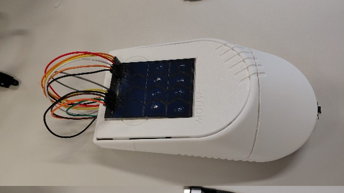
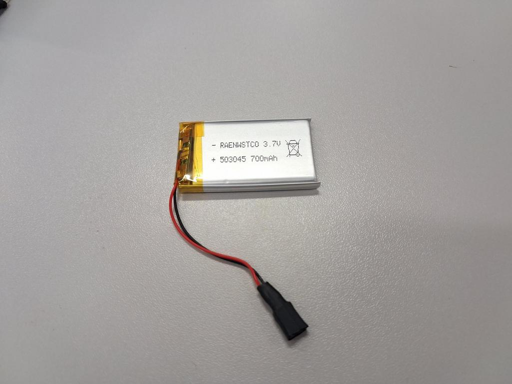
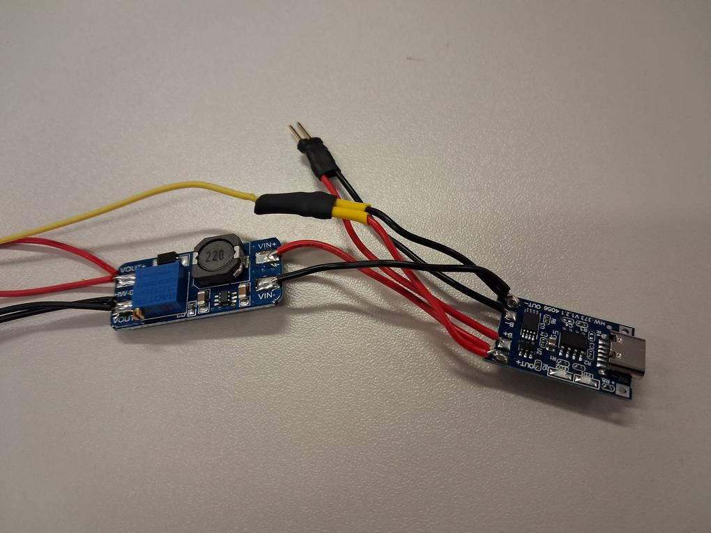
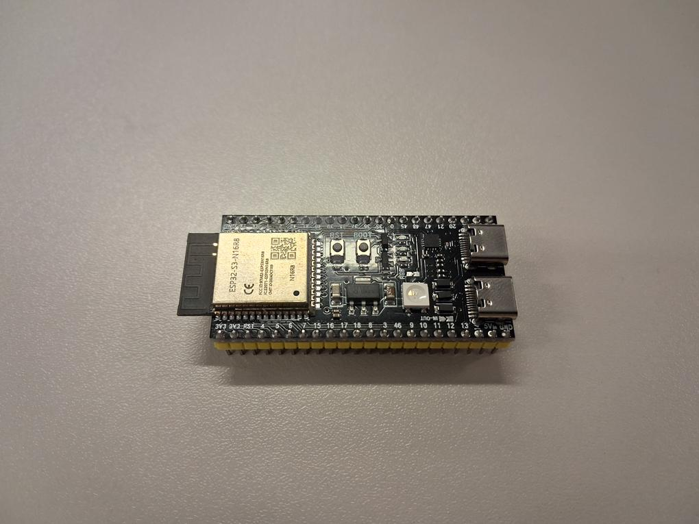
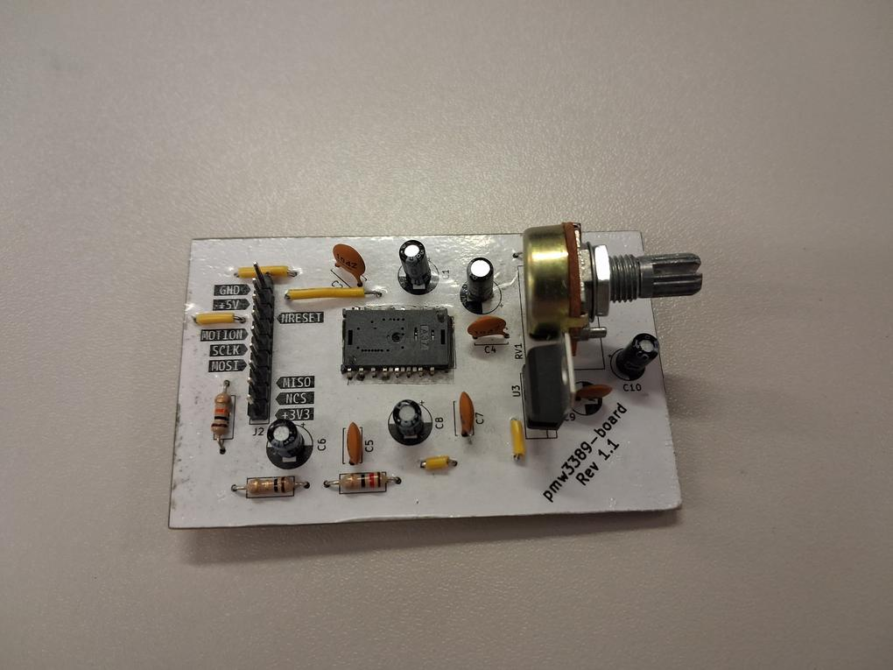
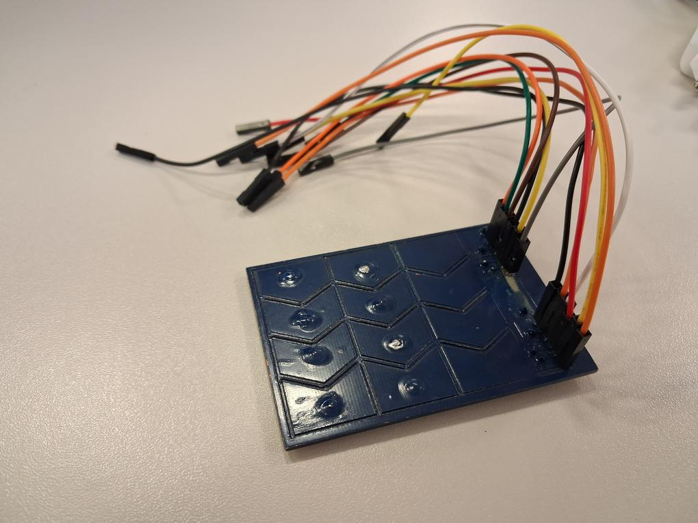

# BTFL Mouse



This project was developed for the Embedded Software for the Internet of Things course at University of Trento (Italy), held by Prof. Yildrim Kasim Sinan.
This project aims to build a Bluetooth mouse that instead of having standard buttons, provides a touch surface. The project covers all different aspects needed to create a Bluetooth mouse from scratch:
- PCB design
- Optical sensor IC usage
- Signal processing for gesture recognition
- Bluetooth HID implementation
- Power management
- Battery monitoring

You can see the video presentation of the project [here](www.youtube.com). TODO INSERT THE LINK

BTFL Mouse stands for Bluetooth Touch Feedback Low-Energy Mouse. It tries to incorporate all these features, except for "feedback", which should be represented by an haptic motor that gives a feedback when touching or doing gestures. Unfortuntely, we didn't have the time to add it yet.

## Contributors

- Ilaria Basanisi: developed the PMW3389DM optical sensor driver and the 3D printed mouse enclosure
- Elena Carmagnani: workflow state machine design and implementation, low power consuption modes
- Daniele Mazzon: Bluetooth HID implementation, battery monitoring system
- Federico G. Rubino: PCB circuit design and printing, touch gesture recognition pipeline

## Hardware requirements

The projects needs the following hardware:
- ESP32-S3 Devkit C1
- PMW3389DM-T3QU optical sensor by PixArt
- custom PCB module for PMW3389DM-T3QU
- custom capacitive touch electrode matrix
- lithium battery
- recharging circuit TP4056
- step-up/boost converter (3-4.2V to 5V)
- custom battery monitoring circuit







## Software requirements

- ESP-IDF version 5.5
- Python 3.12 (only for touch gesture recognition debugging)
- GCC 10.0 (only for unit tests)

## Setup

Install ESP-IDF, which supports Windows, Linux and MacOS. You can find all the instructions [here](https://docs.espressif.com/projects/esp-idf/en/v5.5.2/esp32s3/get-started/index.html), following the instructions for `esp32s3` and a version `>= 5.5`.

Download this repository.
```bash
git clone --recurse-submodules git@github.com:mazzon0/BTFL-Mouse.git && cd BTFL-Mouse
```

In general, refer to the [ESP-IDF documentation](https://docs.espressif.com/projects/esp-idf/en/v5.5.2/esp32s3/get-started/index.html) on how to setup the environment, since this is done differently on Windows, Linux, MacOS, VSCode extenstion and Eclipse expension.
On a Linux and MacOS systems, it is sufficient to export the needed environment variables:
```bash
. path/to/esp-idf/export.sh
```

Now you can build the project.
```bash
idf.py build
```

If you want to disable logging to get a faster executable, you can build the executable with the following command.
```bash
idf.py -DCMAKE_C_FLAGS="-DLOG_LOCAL_LEVEL=0" build
```

Now you can connect the COM port of the board to the computer, and then upload the executable to the board.
```bash
idf.py flash
```

The custom PCBs can be found in the `pcb/` directory.

## Repository structure
```
.
├── components/
│   ├── hogp/           # HID Over GATT Profile (Bluetooth)
│   │   ├── include/
│   │   ├── src/
│   │   ├── test/
│   │   ├── CMakeLists.txt
│   │   └── README.md
│   ├── pmw3389dm/      # Optical Sensor
│   │   ├── include/
│   │   ├── src/
│   │   ├── CMakeLists.txt
│   │   └── README.md
│   └── tmx/            # Touch matrix
│       ├── include/
│       ├── src/
│       ├── CMakeLists.txt
│       └── README.md
├── main/               # Main component
│   ├── src/
│   ├── CMakeLists.txt
│   ├── idf_component.yml
│   └── README.md
├── pcb/
│   └── pmw3389-sensor-board/
├── dependencies.lock
├── CMakeLists.txt
├── sdkconfig
├── LICENSE
└── README.md
```

## Implementation Details

You can find more details about general mouse FSM and power management implementation in `main/`.

You can find more details about Bluetooth HID implementation in `components/hogp/`.

You can find more details about touch gesture pipeline implementation in `components/tmx/`.

You can find more details about optical sensor IC interfacing implementation in `components/pmw3389/`.

## Thanks

We would like to thank the university FabLab for their support for PCB design and printing, and for 3D printing of the case.
